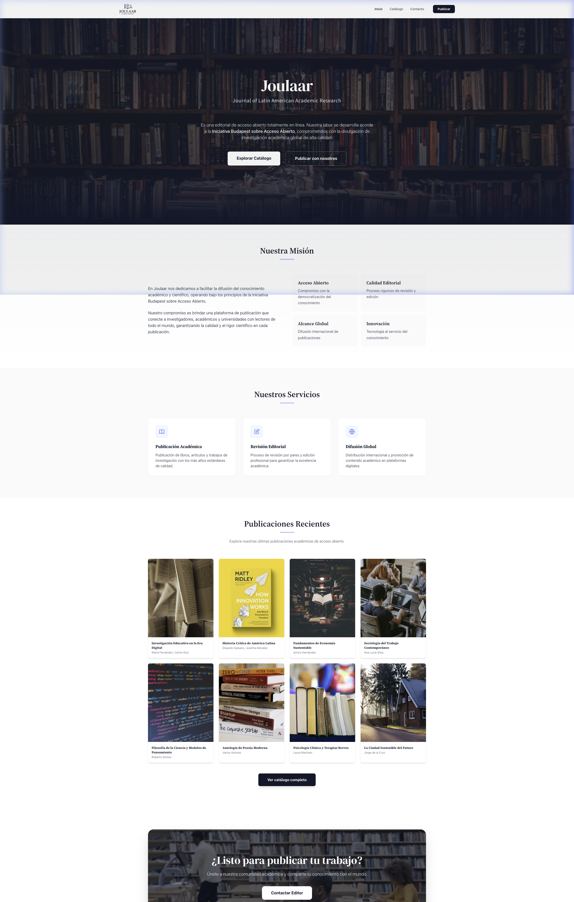

# Joulaar - Journal of Latin American Academic Research

Joulaar es una editorial de acceso abierto totalmente en línea, desarrollada bajo los principios de la Iniciativa Budapest sobre Acceso Abierto. Esta plataforma está construida utilizando **Laravel** y **Blade**, consolidando todo el sistema (Frontend y Backend) en una arquitectura monolítica para máxima estabilidad y rendimiento.

## Características

- **Diseño Responsivo y Limpio:** Utilizando Tailwind CSS y fuentes tipográficas elegantes (DM Serif Display, Source Serif 4).
- **Catálogo Optimizado:** Implementación de *Infinite Scroll* y Búsqueda asíncrona sin afectar la carga inicial del servidor (SSR renderizado en la primera página).
- **Acceso Abierto:** Publicación y lectura de documentos académicos de forma global.

## Tour de la Web (Frontend)

Aquí puedes ver cómo luce el proyecto actualmente:

### Página de Inicio (Home)
La portada principal presenta nuestra misión y publicaciones destacadas.

### Catálogo de Libros
Explora las distintas publicaciones, con sistema de carga asíncrona e *infinite scroll* integrado.

## Tecnologías Utilizadas

- **Backend:** Laravel 11 (PHP 8.2+)
- **Frontend:** Blade Templates, Tailwind CSS, Vanilla JS
- **Base de Datos:** SQLite (configurable a MySQL/PostgreSQL)
- **Asset Pipeline:** Vite

---
*© Joulaar - Todos los derechos reservados.*
